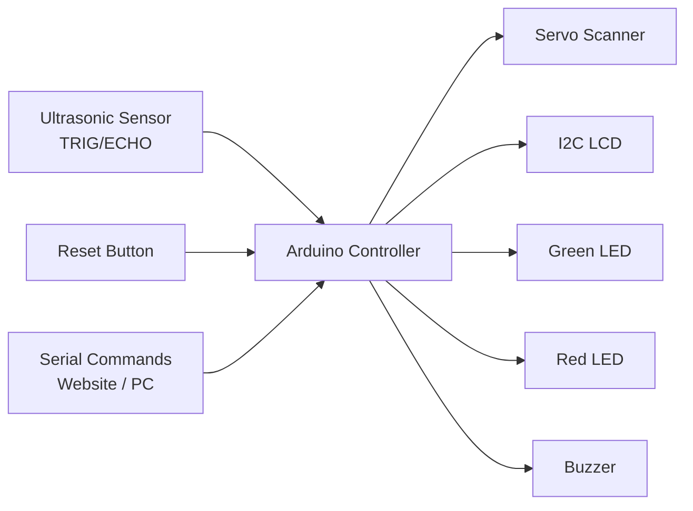
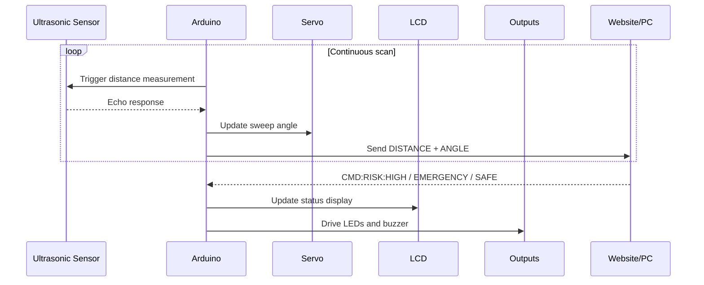

# SEAMS
# 

<div align="center">


</div>

<div align="center">
  
</div>

<p align="center">
  <b>SEAMS</b> is a smart embedded monitoring project that combines ultrasonic distance sensing, servo-based scanning, visual alerts, buzzer alarms, LCD feedback, and serial-command control into one compact safety system.
</p>

<p align="center">
  It behaves like a mini radar-inspired protection unit: it scans space, streams telemetry, reacts to risk levels, and lets a connected interface push emergency or safe-state commands in real time.
</p>

***

## ✦ Overview

SEAMS is built around an Arduino-driven sensing loop that continuously measures distance using an ultrasonic sensor and rotates a servo to sweep the environment. The system also manages a green/red LED status layer, a buzzer alarm, a reset button, and an I2C LCD that displays the current safety state and user prompts.

What makes the project interesting is that the risk state is not only local; it can also be controlled through serial commands such as `CMD:RISK:HIGH`, `CMD:RISK:EMERGENCY`, and `CMD:SAFE`, which means SEAMS is already structured like a hybrid hardware-software safety platform.

***

## ✦ Core Features

<table>
  <tr>
    <td width="50%">
      <h3>📡 Servo Radar Sweep</h3>
      <p>The servo continuously scans from <b>0° to 180°</b> and back, creating a radar-style sweep effect for environmental coverage.</p>
    </td>
    <td width="50%">
      <h3>📏 Live Distance Telemetry</h3>
      <p>The ultrasonic sensor measures distance and sends structured serial output in the format <code>DISTANCE:x,ANGLE:y</code>.</p>
    </td>
  </tr>
  <tr>
    <td width="50%">
      <h3>🚨 Multi-State Risk Engine</h3>
      <p>The firmware supports <b>SAFE</b>, <b>HIGH</b>, and <b>EMERGENCY</b> states with dedicated output behavior.</p>
    </td>
    <td width="50%">
      <h3>🖥️ LCD Status Interface</h3>
      <p>An I2C LCD displays initialization messages, safe monitoring updates, and alert prompts for quick human-readable feedback.</p>
    </td>
  </tr>
  <tr>
    <td width="50%">
      <h3>🔕 Hardware Reset Logic</h3>
      <p>A physical reset button immediately silences alarms, restores the safe state, and emits a reset event over serial.</p>
    </td>
    <td width="50%">
      <h3>🔌 Serial Command Bridge</h3>
      <p>The project can receive external commands from a website or host application, making it ready for future dashboards and safety-control interfaces.</p>
    </td>
  </tr>
</table>

***

## ✦ Hardware Stack

<div align="center">



</div>

### Components used

- Arduino board
- Ultrasonic sensor
- Servo motor
- I2C LCD display
- Green LED
- Red LED
- Buzzer
- Push button
- Jumper wires and power source

***

## ✦ Pin Configuration

| Component | Pin |
|---|---:|
| Ultrasonic TRIG | D9 |
| Ultrasonic ECHO | D10 |
| Green LED | D2 |
| Red LED | D3 |
| Buzzer | D4 |
| Reset Button | D5 |
| Servo | D6 |
| I2C LCD | SDA/SCL |

***

## ✦ System Behavior

### Safe mode
- Green LED stays active.
- Red LED remains off.
- Buzzer stays silent.
- LCD shows safe monitoring text.
- Servo continues scanning and telemetry keeps streaming.

### High risk mode
- Red LED turns on.
- Buzzer activates.
- LCD shows `Risk: HIGH`.
- Intended for suspicious but non-critical conditions.

### Emergency mode
- Red LED remains on.
- Buzzer activates strongly.
- LCD shows `Risk: EMERGENCY!` and prompts user attention.
- Suitable for urgent hazard conditions.

### Reset event
- Alarm is silenced instantly.
- State is forced back to `SAFE`.
- Serial emits `EVENT:RESET_PRESSED` for external systems.

***

## ✦ Serial Protocol

SEAMS already includes a simple protocol that makes it easy to integrate with a website, Python dashboard, or desktop control panel.

### Incoming commands

```text
CMD:RISK:HIGH
CMD:RISK:EMERGENCY
CMD:SAFE
```

### Outgoing telemetry

```text
DISTANCE:42,ANGLE:97
EVENT:RESET_PRESSED
```

This structure is excellent for turning the project into a full software-driven monitoring platform later.

***

## ✦ Firmware Highlights

```cpp
if (incomingCommand == "CMD:RISK:HIGH") riskState = "HIGH";
else if (incomingCommand == "CMD:RISK:EMERGENCY") riskState = "EMERGENCY";
else if (incomingCommand == "CMD:SAFE") riskState = "SAFE";
```

```cpp
Serial.print("DISTANCE:");
Serial.print(distance);
Serial.print(",ANGLE:");
Serial.println(servoAngle);
```

```cpp
if (riskState == "EMERGENCY") {
  digitalWrite(GREEN_LED, LOW);
  digitalWrite(RED_LED, HIGH);
  tone(BUZZER_PIN, 1000);
}
```

These snippets show the real character of the project: sensor fusion, reactive outputs, and external command control.

***

## ✦ Why this project stands out

Unlike a basic sensor alarm, SEAMS behaves like a compact interactive surveillance and alert node. It does not just detect; it scans, reports, displays, and reacts.

That makes it useful for:
- Smart room monitoring
- Restricted area alert systems
- Prototype safety stations
- Lab equipment observation
- Robotics sensing demos
- Human-machine interface experiments

***

## ✦ Project Architecture



***

## ✦ Getting Started

### 1. Clone the repository

```bash
git clone https://github.com/Naman2641/SEAMS.git
cd SEAMS
```

### 2. Open the firmware

Open `main.ino` in the Arduino IDE.

### 3. Install required libraries

Install these libraries before uploading:
- `Wire`
- `LiquidCrystal_I2C`
- `Servo`

### 4. Upload to the board

Select the correct board and COM port, then upload the sketch.

### 5. Open Serial Monitor

Use `9600 baud` to view telemetry and test command-based control.

***

## ✦ Future Upgrades

If expanded further, SEAMS can evolve into a much more advanced system:

- Web dashboard with radar visualization
- Threat heatmap from angle-distance data
- AI-based anomaly scoring
- GSM / SMS emergency reporting
- Local data logging
- Multi-sensor fusion with PIR, gas, or temperature sensors
- Desktop control center for remote monitoring

***

## ✦ Repository Structure

```text
SEAMS/
├── README.md
└── main.ino
```

***

## ✦ Suggested tagline options

- **SEAMS — Smart Environmental Alert & Monitoring System**
- **SEAMS — A radar-inspired embedded safety node**
- **SEAMS — Scan. Sense. Alert. Respond.**

***

## ✦ Author

**Naman Kumar Gupta**  
Embedded systems -  Arduino projects -  intelligent hardware-software integration

***

<div align="center">
  
</div>
