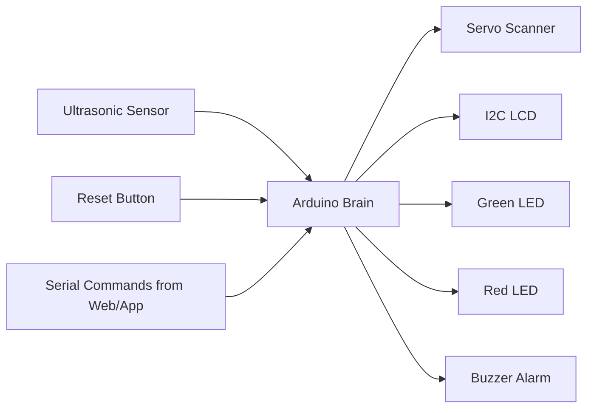
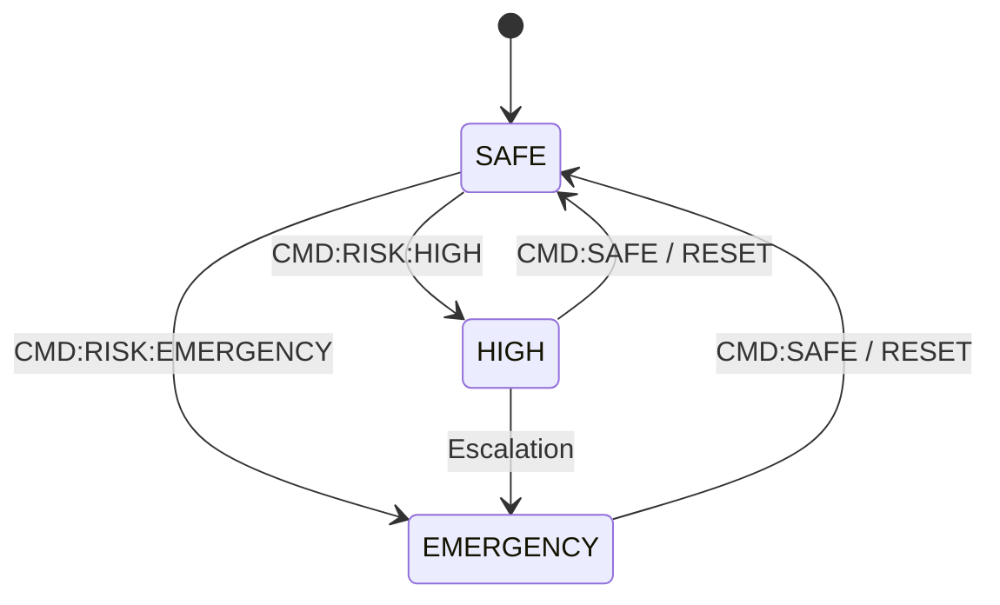

# <div align="center"></div>

<div align="center">
  
</div>

<div align="center">


</div>

<div align="center">
  
</div>

<div align="center">
  
</div>

<div align="center">
  
</div>

***

##  Mission Profile

SEAMS is an Arduino-based smart monitoring system that scans physical surroundings using an ultrasonic sensor and servo motor, then reacts through LEDs, buzzer output, LCD status text, and serial telemetry. The repository currently contains `main.ino` and `README.md`, and the firmware implements distance measurement, servo sweep motion, local alert outputs, and serial-controlled risk state changes. [1]

The project supports three main operating states — `SAFE`, `HIGH`, and `EMERGENCY` — while also accepting incoming commands like `CMD:RISK:HIGH`, `CMD:RISK:EMERGENCY`, and `CMD:SAFE` over Serial. It also emits structured telemetry such as `DISTANCE:<value>,ANGLE:<value>` and reset events, which makes it ready for future integration with a website or dashboard. [1]

***

##  Visual Command Deck

<div align="center">
  
</div>



<div align="center">
  
  
  
  
</div>

***

##  Features That Move

<table>
<tr>
<td width="50%">

### 📡 Radar-style sweep
The servo sweeps across the environment from `0°` to `180°` and back continuously, creating a dynamic scan pattern for environmental monitoring. [1]

</td>
<td width="50%">

### 📏 Live telemetry stream
The firmware transmits values in a structured `DISTANCE:x,ANGLE:y` format so the sensing logic can be visualized externally. [1]

</td>
</tr>
<tr>
<td width="50%">

### 🚨 Multi-risk states
The system switches behavior based on `SAFE`, `HIGH`, and `EMERGENCY` modes with separate output actions. [1]

</td>
<td width="50%">

### 🖥️ Human-readable LCD feedback
The I2C LCD shows initialization text, safe state updates, and emergency messages for direct on-device status reporting. [1]

</td>
</tr>
<tr>
<td width="50%">

### 🔕 One-press alarm silence
The hardware reset button forces the system back to `SAFE`, silences the buzzer, and sends reset events over serial. [1]

</td>
<td width="50%">

### 🔌 Website-ready command bridge
Serial command handling already allows a future website or Python app to control system risk states in real time. [1]

</td>
</tr>
</table>

***

##  Hardware Matrix

| Component | Role | Pin |
|---|---|---:|
| Ultrasonic TRIG | Trigger pulse output | D9 [1] |
| Ultrasonic ECHO | Echo pulse input | D10 [1] |
| Green LED | Safe indication | D2 [1] |
| Red LED | Risk indication | D3 [1] |
| Buzzer | Audible alarm | D4 [1] |
| Reset Button | Manual alarm reset | D5 [1] |
| Servo Motor | Scan sweep | D6 [1] |
| I2C LCD | Status display | SDA/SCL [1] |

***

##  Operating States



- **SAFE** — Green LED on, buzzer off, LCD shows safe monitoring text, servo continues scanning. [1]
- **HIGH** — Red LED on, buzzer active, LCD shows `Risk: HIGH`. [1]
- **EMERGENCY** — Red LED on, buzzer active, LCD shows `Risk: EMERGENCY!` and prompts a user response. [1]
- **RESET** — Forces safe state and emits `EVENT:RESET_PRESSED` for external systems. [1]

***

##  Serial Interface

### Incoming commands

```text
CMD:RISK:HIGH
CMD:RISK:EMERGENCY
CMD:SAFE
```

### Outgoing events

```text
DISTANCE:42,ANGLE:97
EVENT:RESET_PRESSED
```

This protocol is already implemented in the current repository and is ideal for building a web dashboard or host control interface on top of the Arduino firmware. [1]

***

##  Firmware Highlights

```cpp
if (incomingCommand == "CMD:RISK:HIGH") riskState = "HIGH";
else if (incomingCommand == "CMD:RISK:EMERGENCY") riskState = "EMERGENCY";
else if (incomingCommand == "CMD:SAFE") riskState = "SAFE";
```

```cpp
Serial.print("DISTANCE:");
Serial.print(distance);
Serial.print(",ANGLE:");
Serial.println(servoAngle);
```

```cpp
if (riskState == "EMERGENCY") {
  digitalWrite(GREEN_LED, LOW);
  digitalWrite(RED_LED, HIGH);
  tone(BUZZER_PIN, 1000);
}
```

These behaviors match the current `main.ino` implementation that powers the repo. [1]

***

##  Launch Sequence

```bash
git clone https://github.com/Naman2641/SEAMS.git
cd SEAMS
```

1. Open `main.ino` in Arduino IDE. [1]
2. Install `Wire`, `LiquidCrystal_I2C`, and `Servo` libraries before upload. [1]
3. Select the correct board and COM port. [1]
4. Upload the firmware. [1]
5. Open Serial Monitor at `9600 baud` to view telemetry and command interaction. [1]

***

##  Upgrade Path

If you continue building SEAMS, the most natural next steps are a radar-style web dashboard, a threat heatmap from angle-distance telemetry, anomaly scoring, multi-sensor fusion, and remote alert transport through GSM or desktop software. Those future directions fit the existing command-and-telemetry architecture already present in the repo. [1]

***

##  Repo Layout

```text
SEAMS/
├── README.md
└── main.ino
```

The current repository view shows `README.md` and `main.ino` on the `main` branch. [1]

***

##  Author Console

<div align="center">
  
  
  
</div>

**Naman Kumar Gupta** — embedded systems, Arduino prototyping, and hardware-software integration. [1]

<div align="center">
  
</div>
